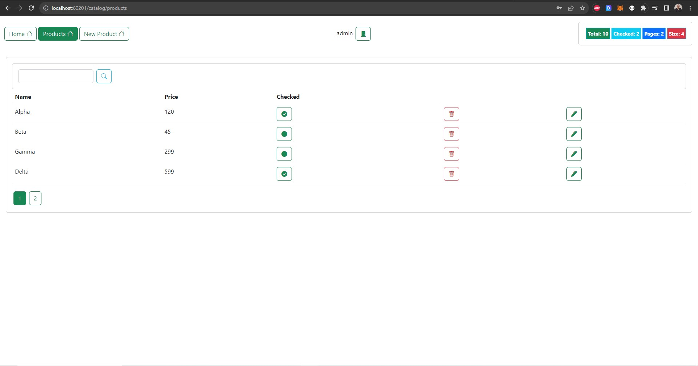

# Angular project with json server

This extensive web application built with Angular seamlessly connects to a JSON Server, offering a sturdy backend for efficient data management. Utilizing the capabilities of Angular, a popular front-end framework, the project delivers a dynamic and engaging user interface.

 

The JWT I created for admin with roles ADMIN and USER

 

The login page:

 

As an ADMIN , he can check all products, modify, and delete each of them:

 

To create a product, we get this message:

 

JWT created for user1 with role USER

 

As a USER, he can only see the products:

 

Once the **'USER'** is trying to create a product, he gets this **"notAuthorized"** page:

